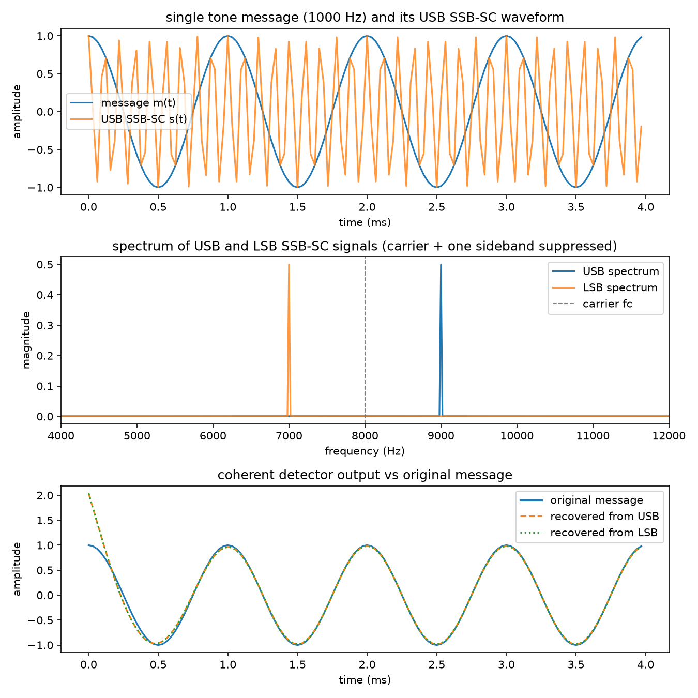
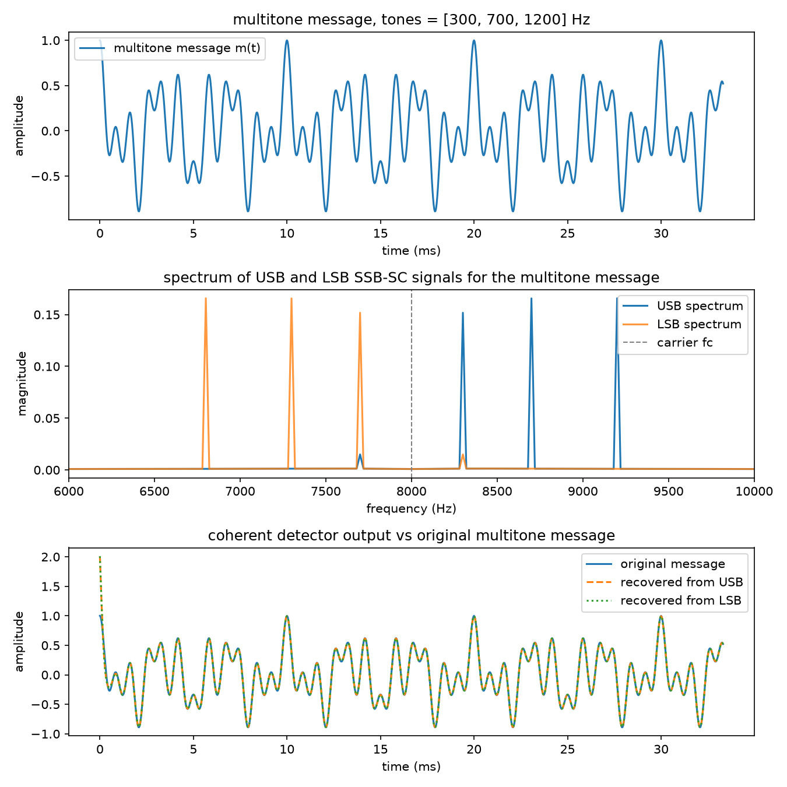

# SSB-SC (Single Sideband Suppressed Carrier) Simulation

Implementation of the Single Sideband Suppressed Carrier communication system described in
[`docs/PRINCIPLES OF COMMUNICATION.pdf`](docs/PRINCIPLES%20OF%20COMMUNICATION.pdf), covering the
phasing-method modulator, single tone and multitone message signals, and a coherent (synchronous)
detector at the receiver.

The original report prototypes the system as GNU Radio flowgraphs. This repo reimplements the same
signal chain in Python (NumPy / SciPy) so it runs anywhere without a GNU Radio install, while keeping
the same block structure and parameters (Hilbert transformer, multiply/add stages, low pass filter
receiver) described in the report.

## Theory recap

An SSB-SC signal is generated from a message `m(t)` and carrier `c(t) = cos(2*pi*fc*t)` using the
phasing method:

```
s_usb(t) = m(t)*cos(2*pi*fc*t) - m_hat(t)*sin(2*pi*fc*t)   (upper sideband)
s_lsb(t) = m(t)*cos(2*pi*fc*t) + m_hat(t)*sin(2*pi*fc*t)   (lower sideband)
```

where `m_hat(t)` is the Hilbert transform of the message (a 90 degree phase shift of every
frequency component). Since only one sideband is transmitted, the SSB-SC bandwidth is `fm` instead
of the `2*fm` needed for DSB-SC.

At the receiver, a coherent detector multiplies the incoming signal by a locally generated carrier
of the same frequency and phase, then low-pass filters the result to recover the message:

```
v(t)  = s(t) * cos(2*pi*fc*t)
m(t)  = LPF(v(t)) * 2
```

## Project layout

```
src/ssb_core.py         core building blocks: tone/multitone generators, FIR Hilbert transformer,
                         SSB modulator, coherent demodulator, spectrum helper
src/single_tone_ssb.py  single tone SSB-SC modulation + demodulation, saves results/single_tone_ssb.png
src/multitone_ssb.py    multitone SSB-SC modulation + demodulation, saves results/multitone_ssb.png
docs/                   original project report (PDF)
results/                generated plots from the two scripts above
```

The Hilbert transform is implemented as a finite-tap FIR filter designed with `scipy.signal.remez`
(the same idea as the "Hilbert, Num Taps: 10k" block used in the GNU Radio flowgraphs), rather than
the ideal FFT-based transform, so the sideband suppression seen in the results reflects a real,
finite-length filter instead of a mathematically perfect one.

## Running it

```
pip install -r requirements.txt
cd src
python single_tone_ssb.py
python multitone_ssb.py
```

Each script prints a short summary to the console and writes a figure to `results/`.

## Results

### Single tone (fm = 1 kHz, fc = 8 kHz)



The spectrum plot shows the carrier and opposite sideband suppressed by roughly 55-60 dB relative to
the transmitted tone, and the coherent detector recovers the original 1 kHz tone from either the USB
or LSB signal almost exactly, aside from the short filter settling transient at the very start.

### Multitone (300 Hz, 700 Hz, 1200 Hz message)



Each of the three tones shows up as its own line in the SSB spectrum, mirrored around the carrier
depending on which sideband is kept, and the recovered waveform tracks the original multitone
message closely after the initial transient dies out.
