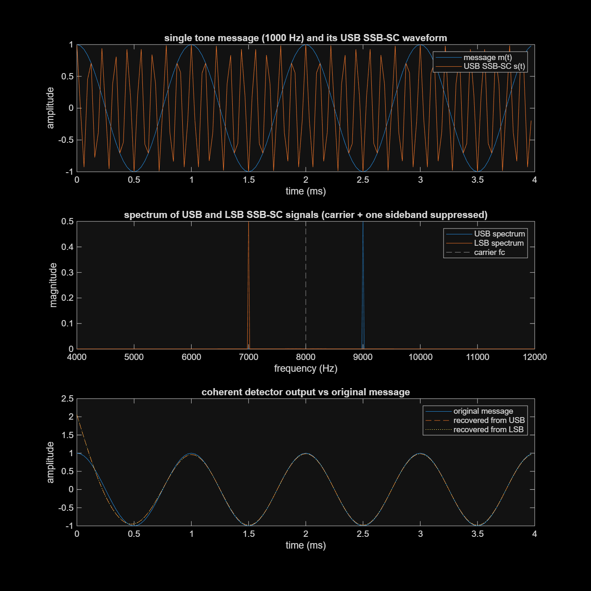
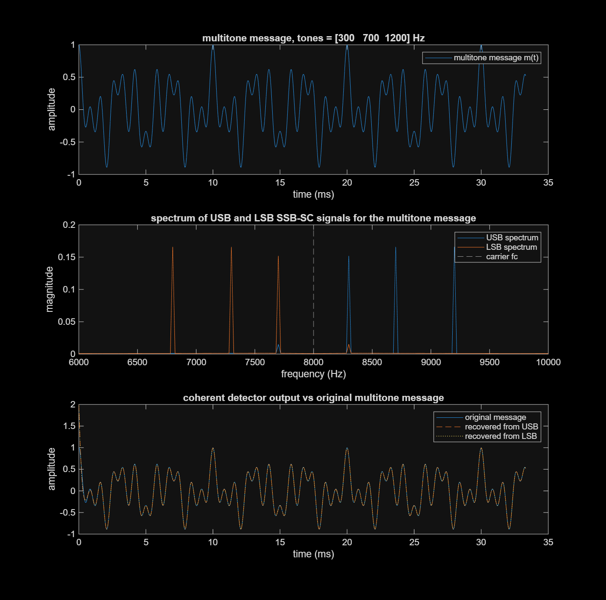
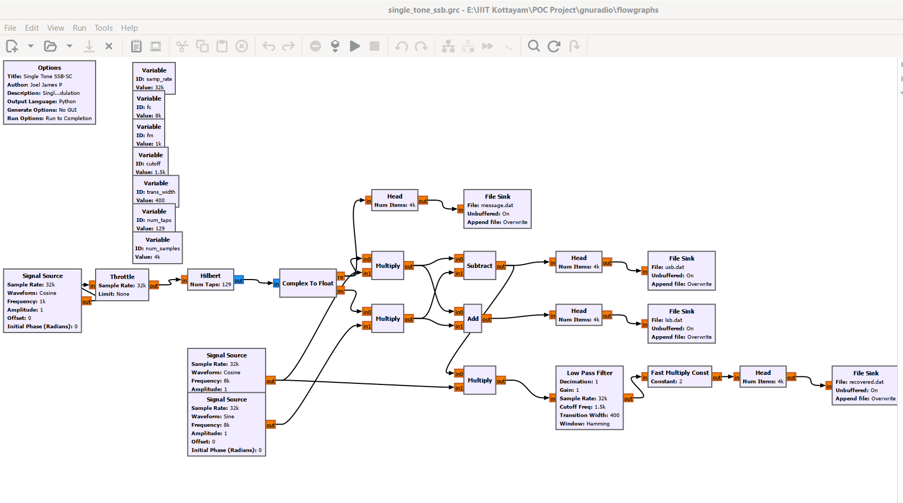
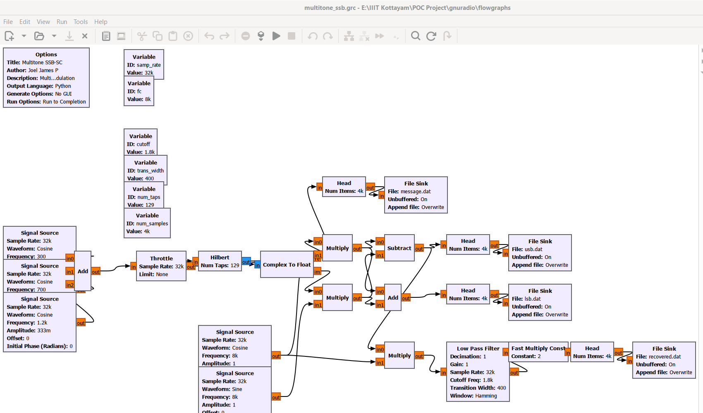
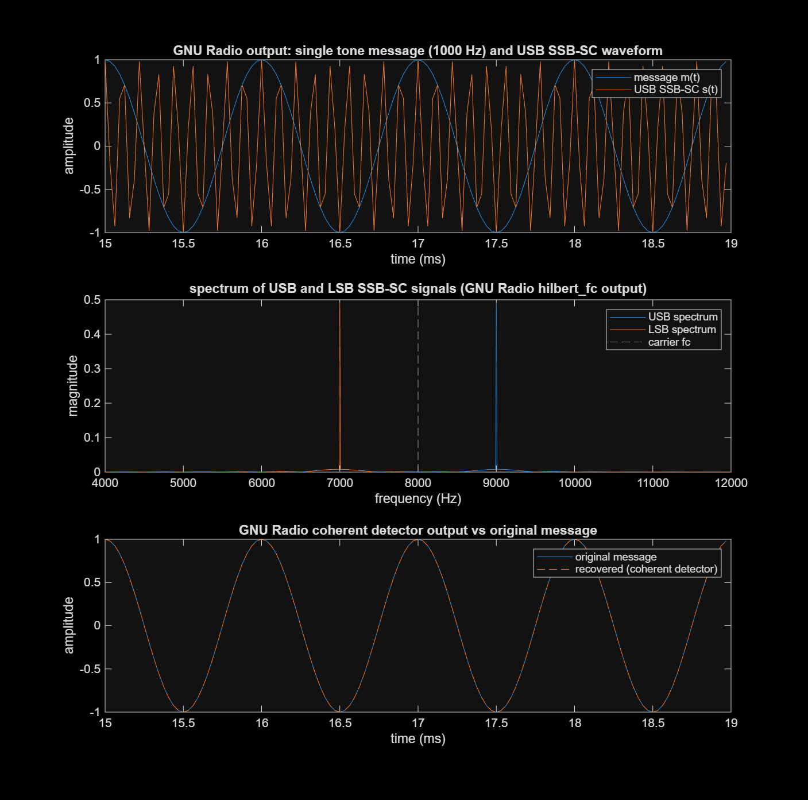
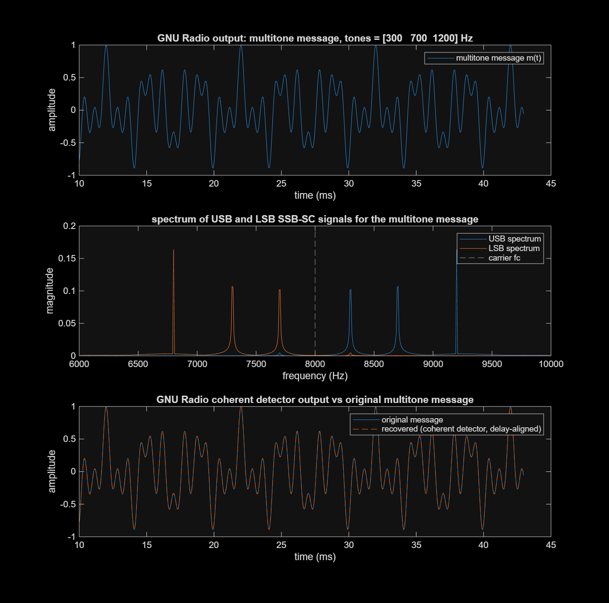

# SSB-SC (Single Sideband Suppressed Carrier) Project

Implementation of the Single Sideband Suppressed Carrier communication system described in
[`docs/PRINCIPLES OF COMMUNICATION.pdf`](docs/PRINCIPLES%20OF%20COMMUNICATION.pdf): the phasing-method
modulator, single tone and multitone message signals, and a coherent (synchronous) detector at the
receiver. The project is implemented two ways:

- **MATLAB** (`matlab/`) — a from-scratch signal processing implementation.
- **GNU Radio** (`gnuradio/`) — the same system as an actual GNU Radio flowgraph, with its own
  output data plotted for the results.

## Theory recap

An SSB-SC signal is generated from a message `m(t)` and carrier `c(t) = cos(2*pi*fc*t)` using the
phasing method:

```
s_usb(t) = m(t)*cos(2*pi*fc*t) - m_hat(t)*sin(2*pi*fc*t)   (upper sideband)
s_lsb(t) = m(t)*cos(2*pi*fc*t) + m_hat(t)*sin(2*pi*fc*t)   (lower sideband)
```

where `m_hat(t)` is the Hilbert transform of the message (a 90 degree phase shift of every
frequency component). Since only one sideband is transmitted, the SSB-SC bandwidth is `fm` instead
of the `2*fm` needed for DSB-SC.

At the receiver, a coherent detector multiplies the incoming signal by a locally generated carrier
of the same frequency and phase, then low-pass filters the result to recover the message:

```
v(t)  = s(t) * cos(2*pi*fc*t)
m(t)  = LPF(v(t)) * 2
```

## MATLAB implementation

```
matlab/hilbert_fir_coeffs.m   Hilbert transformer FIR design (Parks-McClellan / firpm)
matlab/ssb_modulate.m         phasing-method SSB-SC modulator (USB or LSB)
matlab/coherent_demod.m       coherent detector (multiply by carrier + low pass filter)
matlab/make_multitone.m       multitone message generator
matlab/single_tone_ssb.m      single tone demo, saves matlab/results/single_tone_ssb.png
matlab/multitone_ssb.m        multitone demo, saves matlab/results/multitone_ssb.png
```

Run with MATLAB (Signal Processing Toolbox required):

```
cd matlab
matlab -batch single_tone_ssb
matlab -batch multitone_ssb
```

### MATLAB results

**Single tone (fm = 1 kHz, fc = 8 kHz)**



USB/LSB sideband suppression comes out to roughly 56-57 dB (a finite 129-tap Hilbert filter, not an
idealized transform), and the coherent detector recovers the original tone almost exactly from
either sideband.

**Multitone (300 Hz, 700 Hz, 1200 Hz message)**



Each tone shows up as its own spectral line, mirrored around the carrier depending on which
sideband is kept, and the recovered waveform tracks the original multitone message closely.

## GNU Radio implementation

```
gnuradio/flowgraphs/single_tone_ssb.grc    single tone TX + coherent RX flowgraph
gnuradio/flowgraphs/multitone_ssb.grc      multitone TX + coherent RX flowgraph
gnuradio/schematics/                       screenshots of the flowgraphs in GNU Radio Companion
gnuradio/data/                             raw float32 output captured from each flowgraph run
gnuradio/read_gnuradio_dat.m               reads a GNU Radio File Sink .dat into MATLAB
gnuradio/plot_single_tone_result.m         plots gnuradio/data/single_tone -> gnuradio/results
gnuradio/plot_multitone_result.m           plots gnuradio/data/multitone -> gnuradio/results
```

Both flowgraphs build the SSB-SC signal with the phasing method — a `Hilbert` block (finite-tap
FIR, same idea as the MATLAB version) feeding two `Multiply` and an `Add`/`Subtract` block to form
the LSB and USB signals — then coherently demodulate the USB signal with a `Multiply` + `Low Pass
Filter`. Rather than the usual live QT GUI plots, each flowgraph runs headless (`Head` blocks cap
it at 4000 samples) and writes the message, USB, LSB and recovered signals straight to `File Sink`
blocks as raw float32 data, so the run is fully reproducible from the command line:

```
grcc -o . -r gnuradio/flowgraphs/single_tone_ssb.grc
grcc -o . -r gnuradio/flowgraphs/multitone_ssb.grc
```

The `.dat` files this produces are read back and plotted from MATLAB (`gnuradio/plot_*.m`), which
is how `gnuradio/results/*.png` below were generated — these are GNU Radio's own numbers, not a
re-run of the MATLAB modulator.

### GNU Radio schematics

**Single tone flowgraph**



**Multitone flowgraph**



### GNU Radio results

**Single tone**



USB sideband suppression measured directly from the flowgraph's own output: ~61 dB. The coherent
detector's recovered signal matches the original tone with an RMS error of ~0.00015 once the
Hilbert/low-pass filter's startup transient has settled.

**Multitone**



The receive chain's causal FIR filters (unlike MATLAB's zero-phase `filtfilt`) introduce a real
group delay (~96 samples here) between the transmitted and recovered signals; the plotting script
finds this delay by cross-correlation and aligns the two before overlaying them and computing the
RMS error (~0.0005 after alignment).
